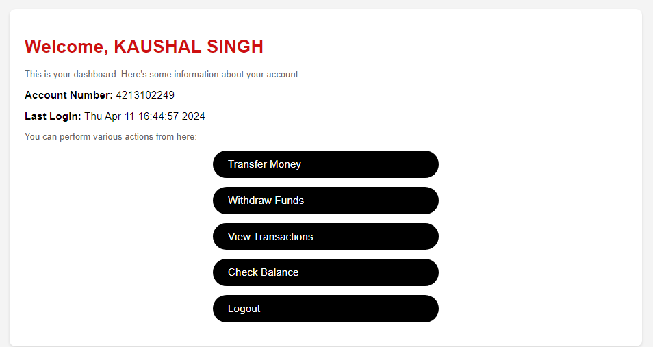

# BANK MANAGEMENT SYSTEM USING FLASK
Description:
The Flask Banking System is a web-based application designed to facilitate account management and transactions for bank customers. It provides functionalities for creating new accounts, logging in, depositing funds, withdrawing funds, checking account balances, and viewing transactions.

<h2>Key Features:</h2>

1.Account Creation: New customers can create accounts by providing their contact information, name, address, selecting an account type (current or savings), and setting a security PIN.

2.Login: Registered customers can log in using their account number and PIN to access their account dashboard.

3.Dashboard: Upon logging in, users are presented with a dashboard displaying their account information, including account number, name, last login timestamp, and current balance.

4.Deposit Funds: Customers can deposit funds into their accounts by specifying the amount they wish to deposit.

5.Withdraw Funds: Customers can withdraw funds from their accounts by specifying the amount they wish to withdraw, provided they have sufficient balance.

6.Check Balance: Customers can check their account balance to view their current available funds.

7.Transaction History: The application keeps a record of transactions for each account, allowing customers to view their transaction history.

<h2>Technologies Used:</h2>

Flask: Flask is a lightweight web application framework written in Python used for building web applications.

HTML/CSS: HTML is used for creating the structure of web pages, while CSS is used for styling and formatting the appearance of web pages.

Jinja2 Templating: Jinja2 is used as the templating engine for generating dynamic HTML content in Flask templates.

CSV File: Account information is stored and retrieved from a CSV file.

Pickling: Python's pickle module is used for serializing and deserializing Python objects to and from a file.

Overall, the Flask Banking System provides a basic yet functional interface for managing bank accounts and conducting transactions online.
